# 🚕 Rideshare Pricing & Demand Dynamics – ML Capstone

A Machine Learning Exploration Using Uber & Lyft Data in Boston  
📅 June 2025 | 🎓 Seattle University – OMSBA 5500 Capstone  
👩‍💼 Led by: Shreeya Sampat | Collaborators: Kezuwera Dibeley, Victor Macedo

---

## 📌 Project Overview

This project investigates the underlying drivers of surge pricing, ride fare variability, and short-term demand forecasting in the rideshare industry.  
As the **team lead**, I directed the project’s technical pipeline — from data integration and modeling to interpretation, fairness analysis, and final reporting.

Using real-world Uber and Lyft data from Boston, we applied machine learning and time series forecasting to uncover insights related to:

- 🚦 Surge pricing prediction  
- 🌦️ Weather-based ride pricing  
- 💸 Socioeconomic fairness in fare distribution  
- 🔮 Short-term ride demand forecasting

---

## 🧪 Core Research Questions

1. What features are most predictive of surge pricing?  
2. How do weather conditions influence ride prices?  
3. Can future ride demand be forecasted using time, location, and weather data?

---

## 🧠 Key Results

| Task                        | Model                      | Performance                          |
|-----------------------------|----------------------------|--------------------------------------|
| Surge Prediction            | Gradient Boosting          | F1 Score: 0.78 · AUC: 0.91           |
| Price Regression (Weather) | Gradient Boosting Regressor| MAE: 0.4069 · R²: 0.0822             |
| Demand Forecasting          | Prophet                    | MAPE: 12.5%                          |

---

## 🧰 Tools & Techniques

- **Languages & Libraries:** Python, Scikit-learn, Prophet, Pandas, NumPy, Seaborn, Matplotlib, Folium  
- **Modeling:** Random Forest, Gradient Boosting, Logistic Regression, Neural Network, Calibrated Linear SVC  
- **Forecasting:** Prophet, ARIMA  
- **Advanced Techniques:** SMOTE for class imbalance, PCA for dimensionality reduction  
- **Feature Engineering:** Temporal flags (e.g., peak hours), income brackets, ZIP mapping, weather buckets

---

## 📊 Visual Highlights

### 📈 ROC Curve – Surge Classification  
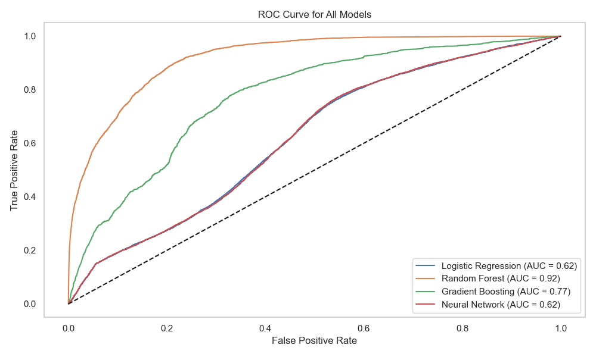

---

### 📊 Confusion Matrices

| Random Forest | Gradient Boosting |
|---------------|-------------------|
| 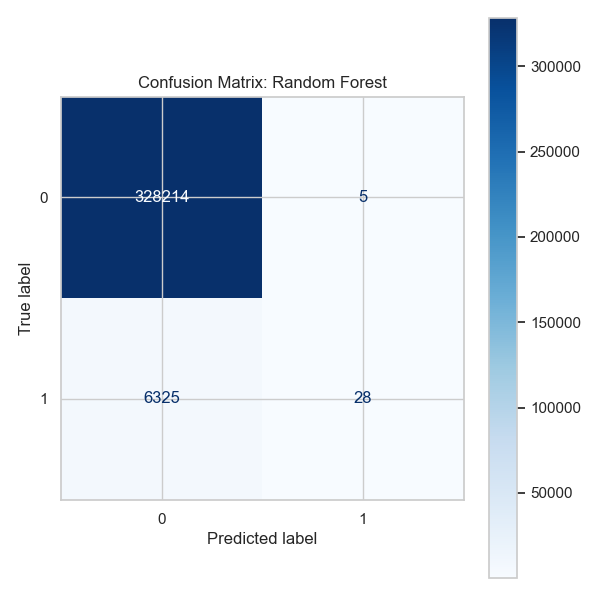 | 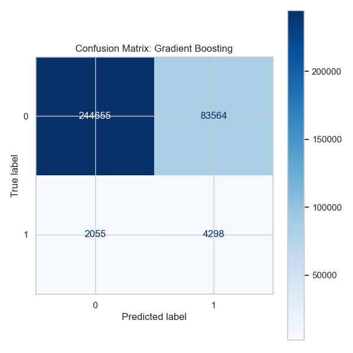 |

| Logistic Regression | Neural Network | Calibrated SVM |
|---------------------|----------------|----------------|
| 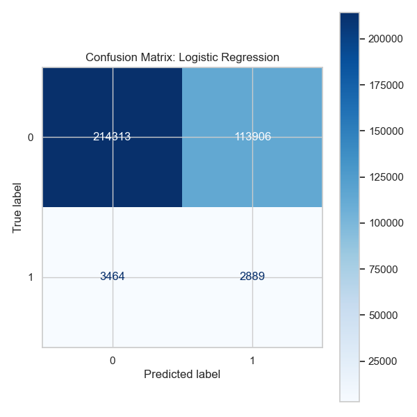 | 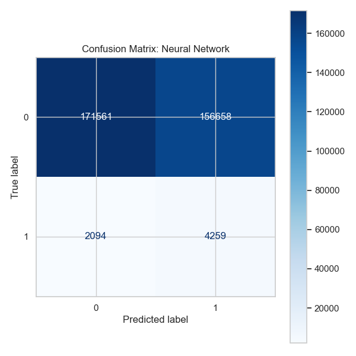 | 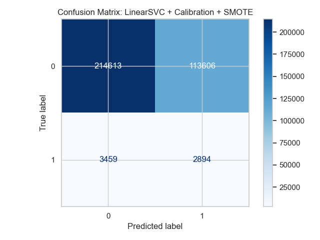 |

---

### 🔮 Prophet Forecast – Ride Demand  

---

### ⏰ Surge Frequency by Hour & Day  
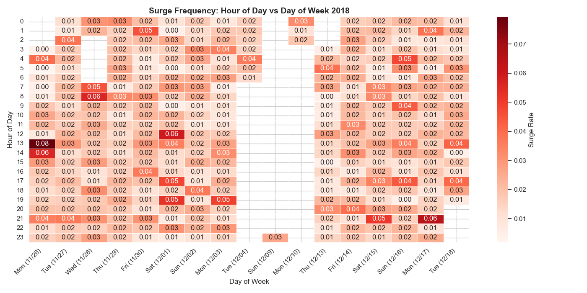

---

### 💰 Income-Based Fare Analysis

**Surge Rate by Income Range**  
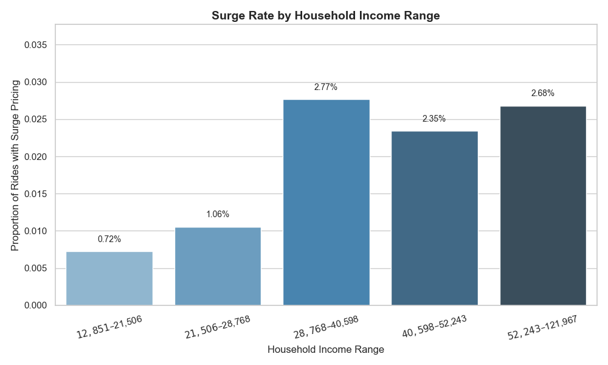

**Average Ride Price by Income**  

---

### 🌦️ Weather & Pricing Relationships

**Weather Correlation Matrix**  
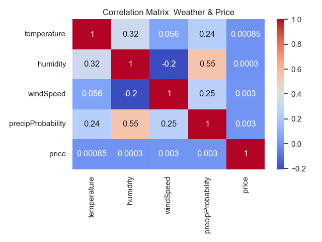

**Distance Correlation Matrix**  
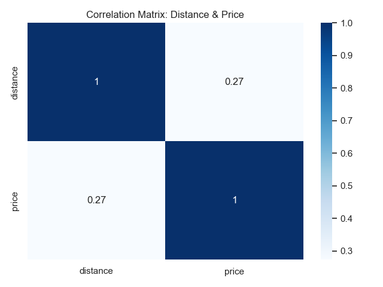

**Actual vs Predicted Ride Prices**  
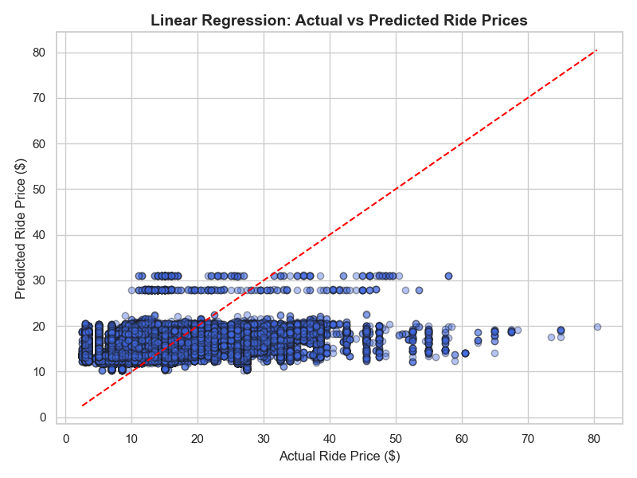

**Average Ride Price by Temperature Range**  
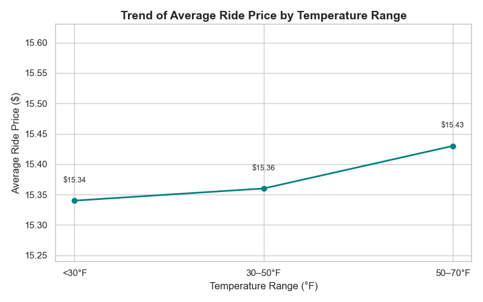

---

### 🔍 Top Feature Importances (Random Forest)  
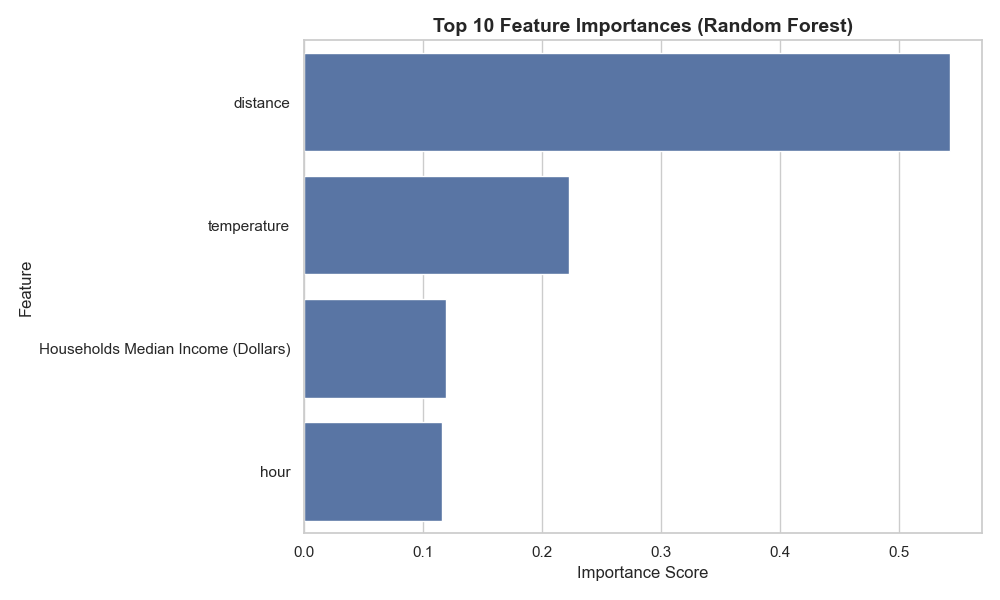

---

## 🗂️ Folder Contents

- `Final_Deliverable_Code.py` – Annotated ML pipeline  
- `Final_Deliverable_Report.pdf` – Technical notebook report  
- `Final_Rideshare Pricing and Demand Dynamics.docx` – Capstone paper  
- `*.png` – Visualizations used throughout  
- `README.md` – This summary file

---

## 🧵 Project Contributions (Led by Shreeya Sampat)

- 🛠️ Designed and executed the full ML pipeline (classification, regression, time-series)
- 🧹 Cleaned and merged multi-source data (trips, weather, ZIP-income)
- 📈 Engineered key features like temporal flags and income brackets
- 📊 Created interactive and static visualizations
- ✍️ Authored technical report, stakeholder narrative, and final documentation
- 🤝 Coordinated team milestones and ensured academic + industry relevance

---

## 💡 Key Insights

- Surge pricing is heavily driven by **time of day, ride distance, and ZIP-code income**
- Higher-income neighborhoods face **more surge events and higher fares**
- **Weather impacts are modest**, but correlate with pricing and demand
- Prophet effectively forecasts **ride demand patterns** (daily + weekend peaks)

---

## ⚖️ Fairness & Equity Observations

Although income was not directly included as a feature, ZIP-based surge behavior reveals **indirect bias**, signaling a need for:

- ✅ Transparency in surge pricing models  
- ✅ Fairness audits on dynamic pricing  
- ✅ Targeted relief for underserved ZIPs  

---

## 🔮 Future Work

- Incorporate real-time traffic & local event signals  
- Expand temporal scope to a full year and other cities  
- Integrate fairness metrics (e.g., disparate impact ratio)  
- Collaborate with municipal agencies to explore pricing equity policy

---

## 📫 Let’s Connect

**Shreeya Sampat**  
Business Analyst | Data Strategist | Project Lead  
📍 Los Angeles, CA  
📧 sampatshreeya@gmail.com  
🔗 [LinkedIn](https://www.linkedin.com/in/shreeyasampat)  
🔗 [View This Project in Portfolio](https://www.notion.so/Hey-I-m-Shreeya-Sampat-1d356f971b5f8066bd3bf59a80de754d?p=21756f971b5f80278a35ec89dcd7a936&pm=c)

---

*Built with 💻 Python, ☕ caffeine, and a passion for fairness in data.*
